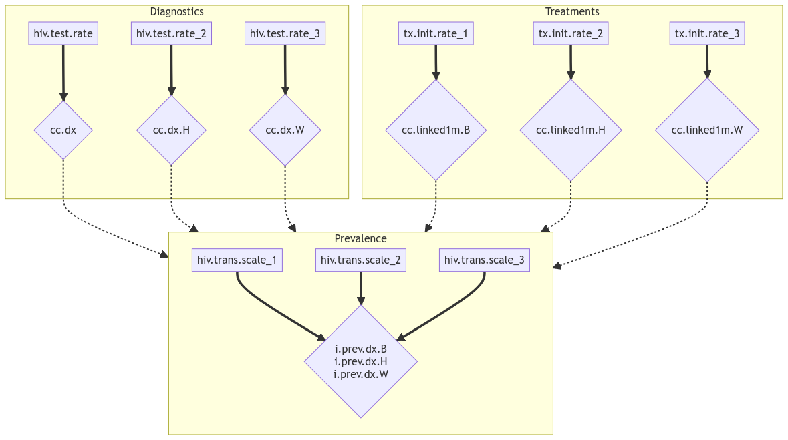

`swfcalib` gives a scaffold to make an automated calibration system on a
[Slurm](https://slurm.schedmd.com/) equipped HPC. `swfcalib` relies on
[`slurmworkflow`](https://github.com/EpiModel/slurmworkflow) and a stored
calibration object to chose which step of the calibration to run. This allows
very long calibrations to take place without flooding the `slurm` queue.

For this vignette we will take as an example a simplified version of one of our
epidemic models to showcase `swfcalib` usage.

This model is a network model simulating HIV circulation in a population of 100k
Men who have Sex with Men (MSM).

## The model

A single run of our model locally looks like this:

```r
library(EpiModelHIV)

epistats <- readRDS("data/input/epistats.rds")
netstats <- readRDS("data/input/netstats.rds")
netest   <- readRDS("data/input/netest.rds")

param <- param.net(
  data.frame.params   = read.csv("data/input/params.csv"),
  netstats            = netstats,
  epistats            = epistats
)

init <- init_msm()

control <- control_msm(
  nsteps = 52 * 60,
  nsims  = 1,
  ncores = 1
)

# The actual simulation happens here
sim <- netsim(est, param, init, control)
```

In this example, we need to load the `EpiModelHIV` package, to read 4 files
located in a "data/input" folder and to pass 4 parameters to the `netsim`
function.

The result, stored in the `sim` variable is not directly usable by `swfcalib`.

## Calibration parameters and outputs

For this example, we will focus on 9 parameters to calibrate and 9 outputs to
fit to there targets.

There are many more parameters in the model. Some get their values from the
literature, other free parameters to be calibrated are ignored for sake of
simplicity in this example.

### Outputs

The first outputs are the proportion of HIV individuals who are diagnosed (i.e.
aware of their status).

Then is the proportion of HIV diagnosed who started treatment in less than a
month after diagnosis.

Finally, the prevalence of
diagnosed HIV in the population is our final output of interest.

As our population is race stratified between, black, hispanic and white, we get
three time the number of outputs.

| Output Name | Description | Target Value|
|-|-|-|
| cc.dx.B | Portion of HIV infected who are diagnosed (black) | 0.847 |
| cc.dx.H | Portion of HIV infected who are diagnosed (hispanic) | 0.818 |
| cc.dx.W | Portion of HIV infected who are diagnosed (white) | 0.862 |
| cc.linked1m.B | Linkage to care within 1 month (black) | 0.829 |
| cc.linked1m.H | Linkage to care within 1 month (hispanic) | 0.898 |
| cc.linked1m.W | Linkage to care within 1 month (white) | 0.881 |
| i.prev.dx.B | HIV diagnosed prevalence (black) | 0.33 |
| i.prev.dx.H | HIV diagnosed prevalence (hispanic) | 0.127 |
| i.prev.dx.W | HIV diagnosed prevalence (W) | 0.084 |

### Parameters

9 parameters will be calibrated to fit the model to these target values:

- The weekly probability of being tested for HIV.
- The weekly probability of starting treatment if diagnosed for HIV.
- A *transmission scaler* which is a parameter that encompass all the mechanism
affecting transmission that are not explicitly defined in the model.

| Parameter Name | Description |
|-|-|
| hiv.test.rate_1 | Weekly test rate (black) |
| hiv.test.rate_2 | Weekly test rate (hispanic) |
| hiv.test.rate_3 | Weekly test rate (white) |
| tx.init.rate_1 | Weekly treatment start rate (black) |
| tx.init.rate_2 | Weekly treatment start rate (hispanic) |
| tx.init.rate_3 | Weekly treatment start rate (white) |
| hiv.trans.scale_1 | Transmission scaler (black) |
| hiv.trans.scale_2 | Transmission scaler (hispanic) |
| hiv.trans.scale_3 | Transmission scaler (white) |

## Relationship between parameters and outputs

Simply by looking at them, we can see that all the parameters do not relate
to all the outputs in the same way.

The `hiv.test.rate` parameters directly relate to the `cc.dx` outputs
(proportion) of diagnosed. Also, no other parameter in our list would affect
these outcomes. Therefore, we have 3 one to one relationship. For each race, the
test rate will govern the diagnosed proportion.

A similar situation can be described for linkage to care (`cc.linked1m`) and
treatment start rate `tx.init.rate`. (the denominator is the number of diagnosed
individuals, making it independent of `cc.dx`).

The prevalence (`i.prev.dx`), on the other hand, depends on all 9 parameters.
The proportion of diagnosed influences the number of treated which then
influences the number of individuals able to transmit. The scalers then affect
directly the transmission for one population. But as they modify the prevalence,
they also indirectly influence the transmission in the other sub populations.

However, once the `hiv.test.rate` and `tx.init.rate` are calibrated and their
values fixed, `i.prev.dx` only depends on the `hiv.trans.scale` parameters.
Reducing a 9 parameters 3 outputs problem into a simpler 3 parameters, 3 outputs
one.

The following graph illustrate these relationships.

```{r, include = FALSE, eval = FALSE }
# meremaid code for graph:
# graph TD
#    subgraph Diagnostics
#        p1[hiv.test.rate] ==> t1{cc.dx}
#        p2[hiv.test.rate_2] ==> t2{cc.dx.H}
#        p3[hiv.test.rate_3] ==> t3{cc.dx.W}
#    end
#
#    subgraph Treatments
#        p4[tx.init.rate_1] ==> t4{cc.linked1m.B}
#        p5[tx.init.rate_2] ==> t5{cc.linked1m.H}
#        p6[tx.init.rate_3] ==> t6{cc.linked1m.W}
#    end
#
#    t1 -.-> Prevalence
#    t2 -.-> Prevalence
#    t3 -.-> Prevalence
#    t4 -.-> Prevalence
#    t5 -.-> Prevalence
#    t6 -.-> Prevalence
#
#    subgraph Prevalence
#        p7[hiv.trans.scale_1]
#        p8[hiv.trans.scale_2]
#        p9[hiv.trans.scale_3]
#
#        t7{
#            i.prev.dx.B
#            i.prev.dx.H
#            i.prev.dx.W
#        }
#    end
#
#    p7 ==> t7
#    p8 ==> t7
#    p9 ==> t7
#
```




## Calibration structure

Knowing these parameters - outputs relationship, we can define a calibration
structure to minimize the number of simulations required.

A first wave will calibrate simultaneously the 3 `hiv.test.rate` and the
3 `tx.init.rate` parameters. This means that each run of the simulation will
test a value for each of these 6 parameters. This idea is similar [factorial
experiment design](https://en.wikipedia.org/wiki/Factorial_experiment) and is
only possible because of the independence between the parameters and their
respective outcomes.

After these 6 parameters are calibrated (i.e. given fixed and final values),
the `hiv.trans.scale` parameters will be calibrated to fit the `i.prev.dx`
outcomes to their target values.

## Waves and jobs

To express this structure, we need to define calibration *jobs* that are
going to be run in parallel within several *waves*.

In our example we will have two *waves*, the first one for the `hiv.test.rate`
and `tx.init.rate` parameters and a second for the `hiv.trans.scale` parameters.

### Jobs

Formally, `swfcalib` defines a *job* as a set of *parameters* to be calibrated
by trying to make a set of *outcomes* reach a set of *targets*.

Each *job* needs a function to make the next set of *parameter* proposals to
test as well as a function for checking if the proposals gave sufficiently good
results. This latter function is in charge of stopping the calibration process
for the current job.

### Waves

A *wave* is a set of multiple jobs that can be run in parallel (i.e.
independent from one another).

In practice, `swfcalib` takes the proposals from all the jobs in a wave, combine
them and run one simulation per proposal. If you have a 3 *job wave*, each
making 10 proposal, only 10 simulations will be run. On the evaluation step
each job will only assess the quality of it's own outcomes.

Once all the *jobs* in a *wave* are finished, the system moves to the next one
if any, using the parameters calibrated on the previous ones.

## Implementing the `model` function

Now that we have a good conceptual idea how the calibration will go, we need to
make our code compatible with `swfcalib`.

For the model function it is pretty straightforward. We need a function with
this signature:

```r
model <- function(proposal) {
  # simulation code
  return(results)
}
```

Where `proposal` is an one row `tibble` with each column being a parameter to
calibrate. In our case, `proposal` is a 1 row 9 columns `tibble`.

And `results` is a one row `tibble` where each column is an output for the
calibration process. In this case, `results` must also be a 1 row 9 columns
`tibble`.

Below is the code for our example.

```r
model <- function(proposal) {
  # Load all required elements
  library(EpiModelHIV)
  library(dplyr)

  epistats <- readRDS("data/input/epistats.rds")
  netstats <- readRDS("data/input/netstats.rds")
  netest   <- readRDS("data/input/netest.rds")

  param <- param.net(
    data.frame.params   = read.csv("data/input/params.csv"),
    netstats            = netstats,
    epistats            = epistats
  )

  init <- init_msm()

  control <- control_msm(
    nsteps = 52 * 60,
    nsims  = 1,
    ncores = 1
  )

  # Proposal to scenario -------------------------------------------------------
  scenario <- EpiModelHPC::swfcalib_proposal_to_scenario(proposal)
  param_sc <- EpiModel::use_scenario(param, scenario)

  # Run the simulation ---------------------------------------------------------
  sim <- netsim(est, param_sc, init, control)

  # Process the results  -------------------------------------------------------
  results <- as_tibble(sim) |>
    mutate_calibration_targets() |>
    filter(time >= max(time) - 52) |>
    select(
      cc.dx.B, cc.dx.H, cc.dx.W,
      cc.linked1m.B, cc.linked1m.H, cc.linked1m.W,
      i.prev.dx.B, i.prev.dx.H, i.prev.dx.W,
    ) |>
    summarise(across( everything(), ~ mean(.x, na.rm = TRUE)))

  # Return the one row `tibble`
  return(results)
}
```

Several things are of importance here:

1. We call `library` within the function. It is not usual, but we must remember
that this will be run on an `sbatch` job from a clean environment. Therefore,
the function must load all the required libraries and files.
2. We must adapt the `proposal` to be used by the simulation. In this case, a
helper function `swfcalib_proposal_to_scenario` does it. But simply copying the
values from the `proposal` `tibble` works as well.
3. After the simulation, the outputs must be processed to produce a correctly
formatted `tibble`. In this case, we take the mean over the last 52 weeks (1
year) for each of the desired outputs.

As the users of `swfcalib`, we are responsible for the correct output of
`model`.

Also, `model` must be a function that run a single simulation and produce a
single set of `results`. This function will be run in parallel to test several
proposals at once.

## Configuring an `swfcalib` system

`swfcalib` maintain a `calib_object` that store the state of the calibration as
well as all it needs to operate. This object is first defined locally and then
updated on the HPC as the calibration progresses.

This object is an `R` `list` with 3 elements: `state`, `config` and `waves`.

We won't cover `state` now as it is created by `swfcalib` and only edited by it.

### Configuration

`config` is a `list` with the following elements:

- `simulator`: the function to calibration `model` in our case
- `root_directory`: where the system will store itself on the HPC
- `n_sims`: the number of simulations to run in parallel at each iteration
- `max_iteration`: the maximum number of iteration before stopping the
  calibration if a satisfactory state is not found. This is a fail-safe
  mechanism to avoid consuming HPC resources when the calibration does not work.
- `default_proposal`: default values for the calibrated parameters. This fixes
  the values for the parameters that are to be calibrated in later waves. Once
  a job is finished, the calibrated value is stored here and used for the next
  runs

```r
config = list(
  simulator = model,
  root_directory = "data/calib",
  n_sims = n_sims,
  max_iteration = 100,
  default_proposal = dplyr::tibble(
    hiv.test.rate_1 = 0.004123238,
    hiv.test.rate_2 = 0.003771226,
    hiv.test.rate_3 = 0.005956663,
    tx.init.rate_1 = 0.2981623,
    tx.init.rate_2 = 0.3680919,
    tx.init.rate_3 = 0.358254,
    hiv.trans.scale_1 = 2.470962,
    hiv.trans.scale_2 = 0.4247816,
    hiv.trans.scale_3 = 0.3342994
  )
)
```

### Waves

`waves` is a list of *waves*, with each wave being a list of jobs

```r
waves = list(
  wave1 = list(
    job1 = list(),
    job2 = list(),
    job3 = list()
  ),
  wave2 = list(
    job1 = list(),
    job2 = list()
  )
    )
```

### Calibration jobs

A calibration *job* is a `list` with 6 elements:

1. `targets`: the name of the outputs to fit (>= 1)
2. `targets_val`: the target values
3. `params`: the names of the parameters to calibrate (>=1)
4. `initial_proposals`: a `tibble` with the values to be tested for the first
  run of the simulation.
5. `make_next_proposals`: a function that will define which proposals to make
  next
6. `get_result`: a function to define is the calibration is done for this job

We will get into the details of these elements later on.

Below is an example of the *job* for calibrating the `hiv.trans.scale`
parameters using the `i.prev.dx` outputs.

```r
job1 = list(
  targets = paste0("i.prev.dx.", c("B", "H", "W")),
  targets_val = c(0.33, 0.127, 0.09),
  params = paste0("hiv.trans.scale_", 1:3),
  initial_proposals = dplyr::tibble(
    hiv.trans.scale_1 = sample(seq(1, 4, length.out = n_sims)),
    hiv.trans.scale_2 = sample(seq(0.2, 0.6, length.out = n_sims)),
    hiv.trans.scale_3 = sample(seq(0.2, 0.6, length.out = n_sims))
  ),
  make_next_proposals =
    swfcalib::make_proposer_se_range(n_sims, retain_prop = 0.3),
  get_result = swfcalib::determ_end_thresh(
    thresholds = rep(0.02, 3),
    n_enough = 100
  )
)
```

### Complete configuration

Below is the complete `calib_object` defined locally. Note that we define an
`n_sims` variable at the beginning and reuse it all over the configuration
to ensure that we have the correct number of proposals at each step.

```r
n_sims  <- 400

calib_object <- list(
  config = list(
    simulator = model,
    default_proposal = dplyr::tibble(
      hiv.test.rate_1   = 0.004123238,
      hiv.test.rate_2   = 0.003771226,
      hiv.test.rate_3   = 0.005956663,
      tx.init.rate_1    = 0.2981623,
      tx.init.rate_2    = 0.3680919,
      tx.init.rate_3    = 0.358254,
      hiv.trans.scale_1 = 2.470962,
      hiv.trans.scale_2 = 0.4247816,
      hiv.trans.scale_3 = 0.3342994
    ),
    root_directory = "data/calib",
    max_iteration = 100,
    n_sims = n_sims
  ),
  waves = list(
    wave1 = list(
      job1 = list(
        targets = "cc.dx.B",
        targets_val = 0.847,
        params = c("hiv.test.rate_1"), # target: 0.00385
        initial_proposals = dplyr::tibble(
          hiv.test.rate_1 = seq(0.002, 0.006, length.out = n_sims),
        ),
        make_next_proposals = swfcalib::make_shrink_proposer(n_sims, shrink = 2),
        get_result = swfcalib::determ_poly_end(0.001, poly_n = 5)
      ),
      job2 = list(
        targets = "cc.dx.H",
        targets_val = 0.818,
        params = c("hiv.test.rate_2"), # target: 0.0038
        initial_proposals = dplyr::tibble(
          hiv.test.rate_2 = seq(0.002, 0.006, length.out = n_sims),
        ),
        make_next_proposals = swfcalib::make_shrink_proposer(n_sims, shrink = 2),
        get_result = swfcalib::determ_poly_end(0.001, poly_n = 5)
        ),
      job3 = list(
        targets = "cc.dx.W",
        targets_val = 0.862,
        params = c("hiv.test.rate_3"), # target: 0.0069
        initial_proposals = dplyr::tibble(
          hiv.test.rate_3 = seq(0.004, 0.008, length.out = n_sims),
        ),
        make_next_proposals = swfcalib::make_shrink_proposer(n_sims, shrink = 2),
        get_result = swfcalib::determ_poly_end(0.001, poly_n = 5)
      ),
      job4 = list(
        targets = paste0("cc.linked1m.", c("B", "H", "W")),
        targets_val = c(0.829, 0.898, 0.881),
        params = paste0("tx.init.rate_", 1:3),
        initial_proposals = dplyr::tibble(
          tx.init.rate_1 = sample(seq(0.1, 0.5, length.out = n_sims)),
          tx.init.rate_2 = sample(tx.init.rate_1),
          tx.init.rate_3 = sample(tx.init.rate_1),
        ),
        make_next_proposals = swfcalib::make_shrink_proposer(n_sims, shrink = 2),
        get_result = swfcalib::determ_poly_end(0.001, poly_n = 3)
      )
    ),
    wave2 = list(
      job1 = list(
        targets = paste0("i.prev.dx.", c("B", "H", "W")),
        targets_val = c(0.33, 0.127, 0.09),
        params = paste0("hiv.trans.scale_", 1:3),
        initial_proposals = dplyr::tibble(
          hiv.trans.scale_1 = sample(seq(1, 4, length.out = n_sims)),
          hiv.trans.scale_2 = sample(seq(0.2, 0.6, length.out = n_sims)),
          hiv.trans.scale_3 = sample(seq(0.2, 0.6, length.out = n_sims))
        ),
        make_next_proposals =
          swfcalib::make_proposer_se_range(n_sims, retain_prop = 0.3),
        get_result = swfcalib::determ_end_thresh(
          thresholds = rep(0.02, 3),
          n_enough = 100
        )
      )
    )
  )
)
```

## Proposers and calibration check

As mentioned earlier, each calibration *job* needs a function to define which
proposal to make at the next iteration (`make_next_proposals`) and a function
to assess if the calibration is finished (`get_result`).

We won't get into the details of how these functions work but focus instead on
their practical use. You can have a look at their respective documentation for
more details.

### HIV test rate

The 3 *jobs* related to `hiv.test.rate` and proportion of diagnosed
among infected (`cc.dx`) use the same approach:

The proposer function is generated by a [function factory](https://adv-r.hadley.nz/function-factories.html):
`make_shrink_proposer(n_sims, shrink = 2)`. This proposer will shrink the range
of proposals by a factor 2 around the best guess so far.

The calibration assessor is made by `determ_poly_end(0.001, poly_n = 5)`. This
function uses linear model with a degree 5 polynomial to predict the best value
for the parameter. The calibration is considered finished when the predicted
value is less than `threshold` away from the target (here `0.001`) AND when the
prediction is not improving after the last iteration.

### Linkage to care

Linkage to care uses the same functions but all 3 parameters and targets are
fitted at once. This here implies that a single model is fitted for all the
data. It works very well in this specific case as the relationship between
linkage to care and treatment uptake rate is consistent over the three groups.

### HIV prevalence

HIV prevalence and transmission scale is harder to calibrate as the 3
parameters and outputs are linked together.

At each iteration the squared error over all 3 targets is calculated for each
proposal. The ranges for the next round of proposals are the ranges of these
best 30% proposals of the previous rounds. The function factory here is
`make_proposer_se_range`. It takes a `retain_prop` argument that governs which
proportion of the simulations are used to define the new ranges.

The calibration is considered done when 100 simulations where the 3 outputs are
less than `thresholds` away from there respective targets. The
`determ_end_thresh` function factory allow us to define the number of *good*
simulations required and the thresholds for each output.

## Running a calibration system

Now that all the pieces are ready, we can setup the workflow using the
[`slurmworkflow`](https://github.com/EpiModel/slurmworkflow) package.

This will allow the HPC to run the calibration steps in a loop until the
calibration is finished.

The following script setup a complete calibration workflow with what was defined
so far.

The main thing you may want to change in this script is the `batch_size`
variable that governs how many sims are run in parallel on a single cluster.
On the RSPH HPC we set it to 8. Therefore, 50 batches of 8 are submitted to
`slurm` at once to make the 400 simulations requested per iteration.

A mail is sent if a job fails or at the end of the 3rd calibration step. This
latter indicate that the calibration process is done.

```r
library("slurmworkflow")

# Define the `model` function
model <- function(proposal) {
  # Load all required elements
  library(EpiModelHIV)
  library(dplyr)

  epistats <- readRDS("data/input/epistats.rds")
  netstats <- readRDS("data/input/netstats.rds")
  netest   <- readRDS("data/input/netest.rds")

  param <- param.net(
    data.frame.params   = read.csv("data/input/params.csv"),
    netstats            = netstats,
    epistats            = epistats
  )

  init <- init_msm()

  control <- control_msm(
    nsteps = 52 * 60,
    nsims  = 1,
    ncores = 1
  )

  # Proposal to scenario -------------------------------------------------------
  scenario <- EpiModelHPC::swfcalib_proposal_to_scenario(proposal)
  param_sc <- EpiModel::use_scenario(param, scenario)

  # Run the simulation ---------------------------------------------------------
  sim <- netsim(est, param_sc, init, control)

  # Process the results  -------------------------------------------------------
  results <- as_tibble(sim) |>
    mutate_calibration_targets() |>
    filter(time >= max(time) - 52) |>
    select(
      cc.dx.B, cc.dx.H, cc.dx.W,
      cc.linked1m.B, cc.linked1m.H, cc.linked1m.W,
      i.prev.dx.B, i.prev.dx.H, i.prev.dx.W,
    ) |>
    summarise(across( everything(), ~ mean(.x, na.rm = TRUE)))

  # Return the one row `tibble`
  return(results)
}

# Create the `calib_object`
n_sims  <- 400
calib_object <- list(
  config = list(
    simulator = model,
    default_proposal = dplyr::tibble(
      hiv.test.rate_1   = 0.004123238,
      hiv.test.rate_2   = 0.003771226,
      hiv.test.rate_3   = 0.005956663,
      tx.init.rate_1    = 0.2981623,
      tx.init.rate_2    = 0.3680919,
      tx.init.rate_3    = 0.358254,
      hiv.trans.scale_1 = 2.470962,
      hiv.trans.scale_2 = 0.4247816,
      hiv.trans.scale_3 = 0.3342994
    ),
    root_directory = "data/calib",
    max_iteration = 100,
    n_sims = n_sims
  ),
  waves = list(
    wave1 = list(
      job1 = list(
        targets = "cc.dx.B",
        targets_val = 0.847,
        params = c("hiv.test.rate_1"), # target: 0.00385
        initial_proposals = dplyr::tibble(
          hiv.test.rate_1 = seq(0.002, 0.006, length.out = n_sims),
        ),
        make_next_proposals = swfcalib::make_shrink_proposer(n_sims, shrink = 2),
        get_result = swfcalib::determ_poly_end(0.001, poly_n = 5)
      ),
      job2 = list(
        targets = "cc.dx.H",
        targets_val = 0.818,
        params = c("hiv.test.rate_2"), # target: 0.0038
        initial_proposals = dplyr::tibble(
          hiv.test.rate_2 = seq(0.002, 0.006, length.out = n_sims),
        ),
        make_next_proposals = swfcalib::make_shrink_proposer(n_sims, shrink = 2),
        get_result = swfcalib::determ_poly_end(0.001, poly_n = 5)
        ),
      job3 = list(
        targets = "cc.dx.W",
        targets_val = 0.862,
        params = c("hiv.test.rate_3"), # target: 0.0069
        initial_proposals = dplyr::tibble(
          hiv.test.rate_3 = seq(0.004, 0.008, length.out = n_sims),
        ),
        make_next_proposals = swfcalib::make_shrink_proposer(n_sims, shrink = 2),
        get_result = swfcalib::determ_poly_end(0.001, poly_n = 5)
      ),
      job4 = list(
        targets = paste0("cc.linked1m.", c("B", "H", "W")),
        targets_val = c(0.829, 0.898, 0.881),
        params = paste0("tx.init.rate_", 1:3),
        initial_proposals = dplyr::tibble(
          tx.init.rate_1 = sample(seq(0.1, 0.5, length.out = n_sims)),
          tx.init.rate_2 = sample(tx.init.rate_1),
          tx.init.rate_3 = sample(tx.init.rate_1),
        ),
        make_next_proposals = swfcalib::make_shrink_proposer(n_sims, shrink = 2),
        get_result = swfcalib::determ_poly_end(0.001, poly_n = 3)
      )
    ),
    wave2 = list(
      job1 = list(
        targets = paste0("i.prev.dx.", c("B", "H", "W")),
        targets_val = c(0.33, 0.127, 0.09),
        params = paste0("hiv.trans.scale_", 1:3),
        initial_proposals = dplyr::tibble(
          hiv.trans.scale_1 = sample(seq(1, 4, length.out = n_sims)),
          hiv.trans.scale_2 = sample(seq(0.2, 0.6, length.out = n_sims)),
          hiv.trans.scale_3 = sample(seq(0.2, 0.6, length.out = n_sims))
        ),
        make_next_proposals =
          swfcalib::make_proposer_se_range(n_sims, retain_prop = 0.3),
        get_result = swfcalib::determ_end_thresh(
          thresholds = rep(0.02, 3),
          n_enough = 100
        )
      )
    )
  )
)

# Workflow ---------------------------------------------------------------------

# Use preconfigured HPC settings
hpc_configs <- EpiModelHPC::swf_configs_rsph(
  partition = "epimodel",
  r_version = "4.3",
  mail_user = "user@emory.edu"
)

wf <- create_workflow(
  wf_name = "Vignette_auto_calib",
  default_sbatch_opts = hpc_configs$default_sbatch_opts
)

# Calibration step 1
wf <- add_workflow_step(
  wf_summary = wf,
  step_tmpl = step_tmpl_do_call(
    what = swfcalib::calibration_step1,
    args = list(
      n_cores = 8,
      calib_object = calib_object
    ),
    setup_lines = hpc_configs$r_loader
  ),
  sbatch_opts = list(
    "cpus-per-task" = 8,
    "time" = "00:20:00",
    "mem-per-cpu" = "4G",
    "mail-type" = "FAIL"
  )
)

# Calibration step 2
batch_size <- 8
batch_numbers <- swfcalib:::get_batch_numbers(calib_object, batch_size)
wf <- add_workflow_step(
  wf_summary = wf,
  step_tmpl = step_tmpl_map(
    FUN = swfcalib::calibration_step2,
    batch_num = batch_numbers,
    setup_lines = hpc_configs$r_loader,
    max_array_size = 500,
    MoreArgs = list(
      n_cores = batch_size,
      n_batches = max(batch_numbers),
      calib_object = calib_object
    )
  ),
  sbatch_opts = list(
    "cpus-per-task" = batch_size,
    "time" = "05:00:00",
    "mem-per-cpu" = "5G",
    "mail-type" = "FAIL"
  )
)

# Calibration step 3
wf <- add_workflow_step(
  wf_summary = wf,
  step_tmpl = step_tmpl_do_call(
    what = swfcalib::calibration_step3,
    args = list(
      calib_object = calib_object
    ),
    setup_lines = hpc_configs$r_loader
  ),
  sbatch_opts = list(
    "cpus-per-task" = 1,
    "time" = "00:20:00",
    "mem-per-cpu" = "8G",
    "mail-type" = "END"
  )
)
```
